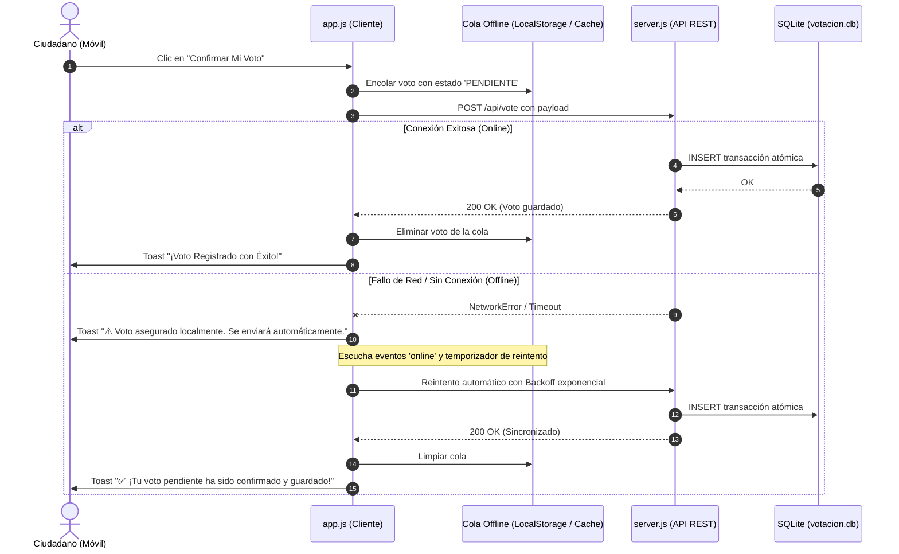

# 📡 ESPECIFICACIÓN DE RESILIENCIA OFFLINE Y COLA DE SINCRONIZACIÓN (SDD-05)

## 1. Problema de Pérdida de Votos en Tránsito
En El Alto, los usuarios navegan en minibuses, teleféricos y zonas periurbanas con fluctuaciones frecuentes de señal móvil (de 4G a 3G o sin servicio). Si un usuario vota justo en un corte de señal de 1-2 segundos, la promesa `fetch()` falla por error de red.

---

## 2. Arquitectura de Cola Resiliente en el Cliente



---

## 3. Especificación Técnica de la Cola
1. **Estructura en `localStorage` (`gamea_pending_votes`):**
   ```json
   [
     {
       "id": "pend_m3k9a1",
       "dishId": "fiambre",
       "district": "Distrito 1 (Ciudad Satélite / Tejada)",
       "city": "El Alto",
       "voterUuid": "voter_...",
       "timestamp": 1727319000000,
       "attempts": 0
     }
   ]
   ```
2. **Disparadores de Despacho:**
   * Al emitir el voto (intento inmediato).
   * Al dispararse el evento `window.addEventListener('online')`.
   * Al cargar la página (`DOMContentLoaded`).
   * Intervalo periódico de sincronización de fondo cada 20 segundos si hay elementos en cola.
3. **Idempotencia:**
   * Si el voto ya había alcanzado a guardarse en el servidor antes de cortarse la respuesta del cliente, el servidor responderá con el estado actual o mensaje amigable y la cola se vaciará limpiamente.
